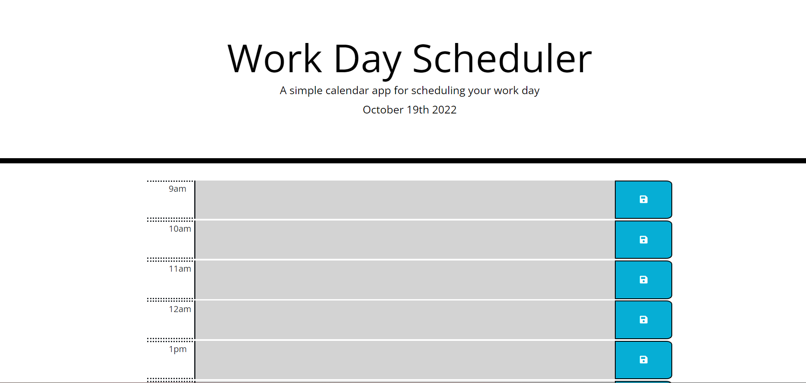
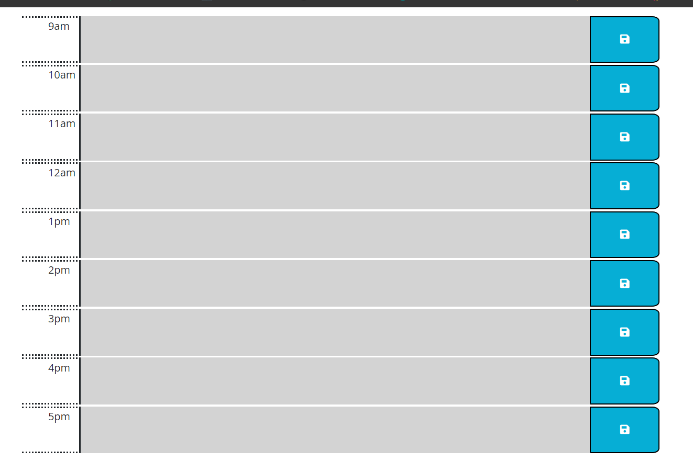

# Daily_ToDo_List

## Description

This is a planer that contains a input input boxes to plan out every hour of a standard work day and saves the input when the save is button is clicked.

## Installation

N/A

## Usage

This can be used to plan out a day using the standard work hours of 9am to 5pm the fields are color coted based on what the cement time and what filed the task was entered in  

The colors are Green (form future events) Red(fore past events) and Yellow(fore current events)

## Credits

N/A

## License
Please refer to the LICENSE in the repo.

## Screen Shots

